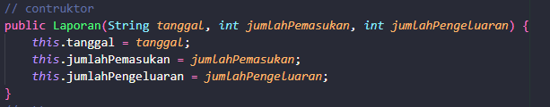
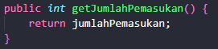

# Tugas Pemrograman Berorientasi Object
Membuat emplementasi encapsulasi dari study case UMKM
## Definisi Encapsulation
Encapsulasi adalah sebuah proses penggabungan atribute dan method ke dalam sebuah class. Biasanya atribute dan method dideskripsikan secara terpisah pada pemrograman prosedural. Selain itu encapsulasi juga dihubungkan dengan pemberian hak akses pada kelas ataupun anggota dari sebuah kelas(atribute dan method). Selain itu pemberian hak akses diberikan pada tiga hal yaitu pada kelas, atribute, dan method.
## Macam Macam Hak Akses di Java
- Public
Digunakan apabila atribute/method ingin bisa diakses di kelas yang lain.
- Private Digunakan apabila atribute atau method hanya ingin diakses pada class pemilik.
- Protected
Digunakan pada konsep pewarisan. Apabila variable dan method dari class pemilik ingin diwariskan untuk class turunan(Child) dari kelas pemilik(Parent) maka bisa menggunakan hak akses ini.
## Code Explanation
- Constructor
Contructor merupakan method yang namanya sama dengan class itu sendiri, contructor merupakan method yang pertama kali dipanggil ketika kita menginstansiasi object yang memiliki constructor tersebut. Biasanya digunakan untuk memberikan nilai default/nilai awal pada atribut disuatu class.

## Getter Setter
- Getter
Method yang dibuat untuk mengambil/mengembalikan nilai sebuah atribute kepada pemanggilnya

